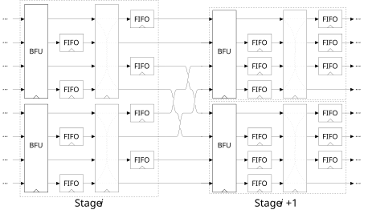
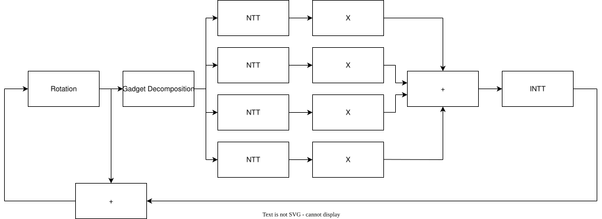
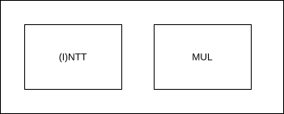

# Flexible Parallel Radix-4 Streaming NTT for FHE

This repository contains the source code for the paper “Flexible Parallel Radix‑4 MDC NTT for FHE”. It provides an RTL library to implement radix‑4 multipath delay commutator (MDC) NTTs, as well as a framework to automatically generate twiddle factors, constants, test vectors, and core files for use with [FuseSoC](https://github.com/olofk/fusesoc).

The hardware design is based on a radix‑4 MDC. It is flexible and supports different primes $Q$ and polynomial sizes $N$. Moreover, the number of compute cores per NTT stage is scalable, making it suitable for a variety of use cases and design requirements. The figure below shows two consecutive radix‑4 MDC stages with two parallel compute cores per stage.



## Application to Fully Homomorphic Encryption

Our work aims to provide a design‑time configurable IP block for deployment in FHE streaming accelerators. Streaming NTTs are common building blocks in FHE accelerators (see, e.g., [Bertels et al.](https://eprint.iacr.org/2025/137), [Van Beirendonck et al.](https://eprint.iacr.org/2022/1635), and [Kim et al.](https://eprint.iacr.org/2024/314)).

While Boolean schemes typically operate on a single polynomial ring modulus per parameter set, schemes such as CKKS usually employ the residue number system (RNS) and therefore operate on multiple ring moduli. However, choosing an auxiliary prime $Q'$ such that

```math
Q' > N \cdot Q_i^2
```

for all RNS moduli $Q_i$ still allows all NTTs to be evaluated modulo the single prime $Q'$ without errors. Our design supports both scenarios.

For accelerators targeting binary schemes, NTT and INTT are not merged as in the diagram below. For such designs, our core supports a Cooley–Tukey (CT) NTT and a Gentleman–Sande (GS) INTT. This combination eliminates the need for bit‑reverse reordering between NTT and INTT. The following figure shows where our hardware design can be used inside a streaming blind‑rotation accelerator for binary FHE schemes such as CGGI:



In the accompanying paper and demo applications, we focus on the `STD128Q` CGGI parameter set and implement a DIT‑based NTT and a DIF‑based INTT suitable for deployment in a blind‑rotation core as shown above.

For other schemes such as CKKS, our design implements a merged (I)NTT core, suitable for architectures similar to the one below:



For RNS schemes, our design allows either (i) generating one NTT for each required ring modulus $Q_i$, or (ii) generating a single NTT with modulus $Q'$ such that $Q' > N \cdot Q_i^2$ and reusing it for all $Q_i$. In the accompanying paper and demo applications, we focus on the Composite Scaling technique of [Agrawal et al.](https://eprint.iacr.org/2023/1462). Composite Scaling enables high‑precision computation when the hardware word size is smaller than the scaling factor $\Delta$ by decomposing each modulus as

```math
Q_i = \prod_j P_j \approx 2^\Delta.
```

Using this technique, we focus on a parameter set with auxiliary prime $P' = 2^{64} - 2^{32} + 1$ satisfying $P' > N \cdot P_j^2$, supporting up to 26‑bit moduli $P_j$ for $N = 2^{12}$.

## Application to Post-Quantum Cryptography and Zero-Knowledge Proofs

As our design is configurable at design time, it can also accelerate other cryptographic schemes that rely on the NTT, e.g., selected post‑quantum cryptography (PQC) schemes and zero‑knowledge proof (ZKP) systems.

## Project Structure

- [data](data/): Data and scripts used for the paper submission, including HJSON configuration files describing design points and the data‑collection script.
- [hw](hw/): SystemVerilog source code of the hardware IP blocks.
- [sw](sw/): Software applications that drive the accelerator, verify the implementation on FPGA, and benchmark it against software.
- [util](util/): Tools and scripts for automatic generation of files (twiddle factors, constants, FuseSoC cores, etc.) and for evaluation.

## Setup and Tools

Install the Python dependencies of the NTT framework:

```bash
python3 -m pip install -r python_requirements.txt
```

The script to compute primitive roots of unity requires [SageMath](https://doc.sagemath.org/html/en/installation/index.html). We use SageMath 9.5. On Ubuntu, install it via:

```bash
sudo apt update
sudo apt install sagemath
```

To run the FPGA demo applications or the [Alveo U55C FPGA tests](sw/test), [XRT](https://github.com/Xilinx/XRT) must be installed. On our deployment platform, we used [XRT 2023.2 build 2.16.204](https://github.com/Xilinx/XRT/releases/tag/202320.2.16.204) and Vitis 2023.2.

For the [demo](sw/demo_parameter) and [benchmarking](sw/benchmark/) applications, [OpenFHE](https://github.com/openfheorg/openfhe-development) must be installed. Our experiments use [OpenFHE v1.4.2](https://github.com/openfheorg/openfhe-development/releases/tag/v1.4.2).

For synthesis we used Vivado/Vitis 2023.2, and for functional verification we used Questa 2024.3.

Compiled simulation libraries for XPM and UNISIM are required, as the hardware design instantiates XPM memories and LUT primitives. For information on how to compile AMD/Xilinx simulation libraries for your simulator, see [UG900](https://docs.amd.com/r/en-US/ug900-vivado-logic-simulation/Compiling-Simulation-Libraries-Using-Vivado-IDE). In case of Questa, the respective `modelsim.ini` is required to reside within [hw/dv](hw/dv).

## Usage

### Generate Parallel Radix-4 Target

The following Python script generates FuseSoC targets for a specific parameter set, both for verification (DV) and synthesis (IP). It also creates randomized test vectors and the required twiddle‑factor ROM images.

```bash
python3 util/ntt_r4mdc.py $N $Q $PSI $W4 $LOGQ sparse $BFUS
```

Example:

```bash
python3 util/ntt_r4mdc.py 1024 33550337 3037 12759331 25 sparse 16
```

The generated synthesis target is placed at:

- `hw/ip/ntt_r4mdc/ntt_r4mdc_$Q_$N_$BFUS.core`

The generated verification target is placed at:

- `hw/ip/ntt_r4mdc/dv/ntt_r4mdc_$Q_$N_$BFUS_dv.core`

Once generated, you can run synthesis or verification via FuseSoC.

#### Synthesis

To synthesize a generated IP target, run:

```bash
./synth_target.sh -s "aisec:ip:ntt_r4mdc_$Q_$N_$BFUS:0.1" $Q_$N_dit $Q_$N_dit
```

#### Verification

To verify a generated DV target via simulation, run:

```bash
./verify_target.sh -s "aisec:dv:ntt_r4mdc_$Q_$N_$BFUS:0.1" $Q_$N_dit $Q_$N_dit
```

If you use a simulator other than Questa, adapt line 21 of [verify_target.sh](./verify_target.sh) accordingly.

## Target Parameter Sets for Case Study and Comparison with Literature

| Scheme     |   N  |           Q           |          PSI          |        W4        |
| :--------- | ---: | --------------------- | --------------------- | ---------------: |
| CGGI       | 1024 |          33550337     |                 3037  |        12759331  |
| CKKS       | 4096 | 18446744069414584321  | 1532612707718625687   | 281474976710656  |
| Comparison | 1024 |         268369921     |              3260661  |        75074761  |

## Reproduction of Results

The [data](data/) directory contains the data used in the paper, the data‑collection script, and the HJSON configuration files describing the design points.

The file [data/data_tcas.hjson](data/data_tcas.hjson) lists the design points. Each design point consists of cryptographic parameters (e.g., modulus and polynomial length) and a hardware configuration (parallelism, target frequency, etc.).

To collect all data points specified in [data/data_tcas.hjson](data/data_tcas.hjson), run:

```bash
python3 data/run_data_collection.py data/data_tcas.hjson
```

Internally, the following steps (described above) are executed for each design point:

1. Generate parallel radix‑4 targets.
2. Synthesis.
3. Verification.
4. Parse and copy generated reports into [data](data/).

Running this script can take several hours, since each design point is synthesized and implemented in Vivado.

## Demo Applications

To demonstrate the applicability of our approach, the repository includes three software demos and proof‑of‑concept FPGA implementations.

- [sw/demo_parameter](sw/demo_parameter): Examples adapted from [OpenFHE](https://github.com/openfheorg/openfhe-development).  
  These implement demo applications for the target parameter sets of our case study. For CGGI, we adapt the [binary FHE example](https://github.com/openfheorg/openfhe-development/blob/main/src/binfhe/examples/boolean.cpp) to the `STD128Q` parameter set. For CKKS, we adapt the [CKKS arithmetic example with Composite Scaling](https://github.com/openfheorg/openfhe-development/blob/main/src/pke/examples/simple-real-numbers-composite-scaling.cpp). For more details on Composite Scaling, see [OpenFHE’s documentation](https://github.com/openfheorg/openfhe-development/blob/main/src/pke/examples/COMPOSITE_SCALING.md) and [Agrawal et al.](https://eprint.iacr.org/2023/1462).

- [sw/test](sw/test): Tests functionality of FPGA bitstreams by comparing FPGA results against automatically generated test vectors (generated via [util/ntt_r4mdc.py](util/ntt_r4mdc.py)).

- [sw/benchmark](sw/benchmark): Compares the runtime of our FPGA implementation on a batch of 32 polynomials against a software implementation based on OpenFHE.

To generate the bitstreams for the AMD Alveo U55C FPGA, run the commands below. If you require additional debug capability, you can append the `--debug` flag to these commands. This adds ILAs for usage with Chipscope on the AXI interfaces between the RTL kernel and the HBM.

```bash
./hw/top_ntt/util/gen_bitstream_top_ntt.sh -s "aisec:fpga:top_ntt_u55c_33550337_1024_16:0.1" 33550337_1024_dit u55c --freq 250
```

```bash
./hw/top_ntt/util/gen_bitstream_top_ntt.sh -s "aisec:fpga:top_ntt_u55c_33550337_1024_16:0.1" 33550337_1024_dif u55c --freq 250
```

```bash
./hw/top_ntt/util/gen_bitstream_top_ntt.sh -s "aisec:fpga:top_ntt_u55c_18446744069414584321_4096_8:0.1" 18446744069414584321_4096_uni_opt u55c --freq 175
```

For the bitstream generation to succeed, ensure that the corresponding targets and constants were generated beforehand via:

```bash
python3 util/ntt_r4mdc.py $N $Q $PSI $W4 $LOGQ sparse $BFUS
```

To build the FPGA verification application for a `dit`/`dif` design run the command below.

```bash
g++ -g -std=c++17 -I$XILINX_XRT/include -L$XILINX_XRT/lib -o sw/test/test_top_ntt.exe sw/test/test_top_ntt.cpp -lxrt_coreutil -pthread
```

To build the FPGA verification application for a `uni` design run the command below.

```bash
g++ -g -std=c++17 -I$XILINX_XRT/include -L$XILINX_XRT/lib -o sw/test/test_top_ntt_rns.exe sw/test/test_top_ntt_rns.cpp -lxrt_coreutil -pthread
```

For the OpenFHE applications, please use the commands below.
```bash
cd sw/{benchmark,demo_parameter}/{cggi,ckks}/
mkdir build
cd build 
cmake ..
make
cd ../../../../
```

To run applications, e.g. verify the `STD128Q` CGGI FPGA design and benchmark it, execute the following commands.

```bash
./sw/test/test_top_ntt.exe -s "aisec:fpga:top_ntt_u55c_33550337_1024_16:0.1" 33550337_1024_{dit,dif} u55c
```

```bash
./sw/benchmark/cggi/build/boolean -s "aisec:fpga:top_ntt_u55c_33550337_1024_16:0.1" 33550337_1024_{dit,dif} u55c
```

To run application, e.g. verify the CKKS [Composite Scaling](https://github.com/openfheorg/openfhe-development/blob/main/src/pke/examples/simple-real-numbers-composite-scaling.cpp) FPGA design and benchmark it, execute the following commands.

```bash
./sw/test/test_top_ntt_rns.exe -s "aisec:fpga:top_ntt_u55c_18446744069414584321_4096_8:0.1" 18446744069414584321_4096_uni u55c
```

```bash
./sw/benchmark/ckks/build/test -s "aisec:fpga:top_ntt_u55c_18446744069414584321_4096_8:0.1" 18446744069414584321_4096_uni u55c
```

## Other Parameter Sets and Primitive Roots of Unity

Our framework supports arbitrary parameter sets. To generate a new configuration, run:

```bash
python3 util/ntt_r4mdc.py $N $Q $PSI $W4 $LOGQ sparse $BFUS
```

To obtain the primitive $N$-th root of unity for a given prime $Q$, use the provided Sage script:

```bash
sage -python util/primitive_nth_rooth.py $Q $N
```

A prerequisite for using our hardware design with a new parameter set is the existence of the corresponding modular‑reduction unit in the project. To add a new reduction implementation, follow the instructions in the next section.

To provide a plug‑and‑play solution for arbitrary parameter sets without additional implementation effort, we will add a word‑level Montgomery multiplier following [Hirner et al.](https://eprint.iacr.org/2023/267).

## Additional Reduction Implementations

To add a new optimized sparse‑reduction implementation, follow these steps:

1. Copy the RTL implementation of the reduction unit into [hw/ip/arith/rtl](hw/ip/arith/rtl).
2. Copy the RTL implementation of the constant‑multiplication unit into [hw/ip/arith/rtl](hw/ip/arith/rtl).
3. Add a new case in [hw/ip/arith/rtl/sparse_reduction.sv](hw/ip/arith/rtl/sparse_reduction.sv).
4. Add a new case in [hw/ip/arith/rtl/const_multiplier.sv](hw/ip/arith/rtl/const_multiplier.sv).
5. Extend the file list in [hw/ip/arith/arith.core](hw/ip/arith/arith.core).
6. Add the corresponding delays in [util/ntt_r4mdc.py](util/ntt_r4mdc.py) in the `compute_delays` function.

## Future Work and Improvements

- Replace the verification environment with a UVM environment.
- Integrate Montgomery reduction to support arbitrary NTT parameter sets without additional implementation effort.
- Automate the integration of additional optimized reduction implementations.
- Explore higher radices together with Fermat numbers ($2^{2^{k}} + 1$) as in [Kim et al.](https://eprint.iacr.org/2024/314).
- Extend the framework for positive wrapped convolution and ZKPs.

## Third-Party Notices
This code base contains AXI read and write master interfaces from [Xilinx Vitis-Tutorials](https://github.com/Xilinx/Vitis-Tutorials/). Parts of the AXI slave interface were designed based on [ZipCPU](https://zipcpu.com/blog/2020/03/08/easyaxil.html) and [Xilinx Vitis-Tutorials](https://github.com/Xilinx/Vitis-Tutorials/). The files residing within [sw/benchmark](sw/benchmark) and [sw/demo_paramter](sw/demo_paramter) contain code examples of [OpenFHE](https://github.com/openfheorg/openfhe-development) licensed under BSD 2-Clause License.
